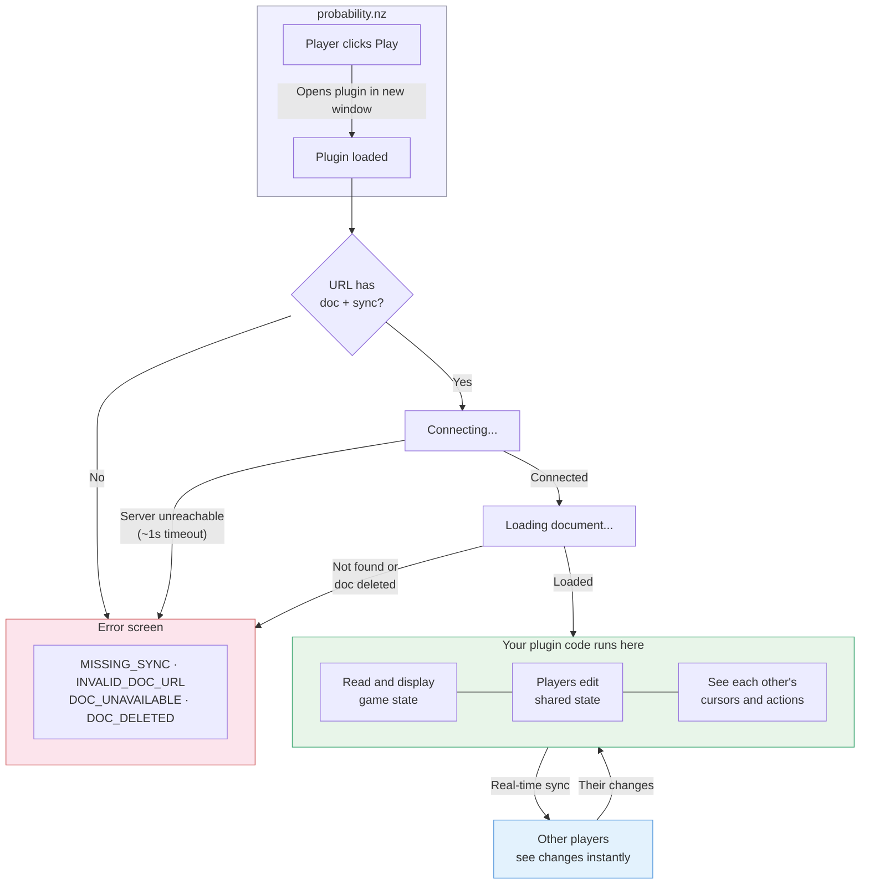

# @probability-nz/plugin-sdk

SDK for [probability.nz](https://probability.nz) plugins. Plugins are apps that connect to shared game documents via [automerge](https://automerge.org/). Works in browsers, Electron, React Ink, or anywhere React runs.

## Getting started

Requires [Node.js](https://nodejs.org/) (v18+) and npm (included with Node) or [pnpm](https://pnpm.io/).

**Try the example:**

```sh
git clone https://github.com/probability-nz/plugin-sdk
cd plugin-sdk/examples/debug
npm install
npm run dev
```

**Start your own plugin:** copy `examples/debug` as a starting point and edit [`src/main.tsx`](./examples/debug/src/main.tsx).

## Architecture



## What's in the SDK

### Exports

- **`@probability-nz/plugin-sdk`** — `useHashStore` (Zustand store for URL hash, browser only), `SDKError`, `toColor`, `HexColor`
- **`@probability-nz/plugin-sdk/react`** — `RepoProvider`, `useDoc`, `useSuspenseDoc`, `useRepo`
- **`@probability-nz/plugin-sdk/schemas`** — Zod schemas for doc validation (GameManifest, Piece)

### Usage

```tsx
import { useHashStore } from '@probability-nz/plugin-sdk';
import { RepoProvider, useDoc } from '@probability-nz/plugin-sdk/react';

// Browser plugin — read config from URL hash, pass as props
function App() {
  const { context } = useHashStore();
  return (
    <Suspense fallback={<p>Connecting...</p>}>
      <RepoProvider sync={context.sync}>
        <MyPlugin doc={context.doc} />
      </RepoProvider>
    </Suspense>
  );
}

function MyPlugin({ doc }: { doc: string }) {
  const result = useDoc<GameState, MyPresence>(doc, MyPresenceSchema);
  if (result.status !== 'ready') return <p>{result.status}</p>;
  const { doc, handle, changeDoc, presence, setPresence, peers } = result;
  // ...
}
```

`RepoProvider` takes a `sync` prop (array of sync server URLs). It suspends until connected and throws `SDKError` on failure — catch with a React error boundary.

`useDoc(docUrl, presenceSchema?)` returns a discriminated union:
- `{ status: 'loading' }` — waiting for document
- `{ status: 'ready', doc, handle, changeDoc, presence, setPresence, peers }` — document loaded
- `{ status: 'error', error: SDKError }` — invalid doc URL or doc deleted

`useSuspenseDoc` is the same but throws on loading/error (use with Suspense + error boundary).

### Hash contract

Browser plugins receive config as a JSON hash fragment:

```
https://plugin.example.com/#{"context":{"doc":"automerge:...","sync":["wss://..."],"identity":"..."}}
```

`useHashStore` parses this. Non-browser environments (Electron, React Ink, tests) skip the hash and pass config directly as props.

### Errors

`RepoProvider` throws `SDKError` on connection errors — catch with React error boundaries. `useDoc` returns errors as `{ status: 'error', error: SDKError }`.

| Error | Source | Description |
|---|---|---|
| `MISSING_SYNC` | RepoProvider | `sync` prop empty or missing |
| `INVALID_DOC_URL` | useDoc | Not a valid `automerge:` URL |
| `DOC_UNAVAILABLE` | useDoc | Document not found — sync server unreachable or doc doesn't exist |
| `DOC_DELETED` | useDoc | Document was deleted |

### Presence

`useDoc` includes presence support. Pass a Zod schema to validate peer state:

```tsx
const result = useDoc<GameState, MyPresence>(docUrl, MyPresenceSchema);
const { presence, setPresence, peers } = result;

// Set local presence (useState-style, throttled)
setPresence({ cursor: { x: 10, y: 20 } });
setPresence(prev => ({ ...prev, cursor: newPos }));

// Read peers — Record keyed by PeerId
Object.values(peers).map(peer => (
  <Cursor key={peer.peerId} color={toColor(peer.peerId)} pos={peer.state?.cursor} />
));
```

Peer `state` is `null` when Zod validation fails (with `console.warn`). Local `setPresence` throws if it fails validation. No schema = no validation.

### Validation schemas

Zod schemas for doc types (GameManifest, Piece) are available at `@probability-nz/plugin-sdk/schemas`.

For document types, see [@probability-nz/types](https://github.com/probability-nz/types). For automerge document operations, see the [automerge docs](https://automerge.org/docs/).

## TODO

- [ ] Multi-doc example and test
- [ ] Tests: schemas, SDKError, useDoc
- [ ] changeDoc metadata (message, timestamp) — needs spec in @probability-nz/types
- [ ] Identity auth — `context.identity` is an opaque string for now, needs signed token spec
- [ ] Offline support — no IndexedDB by default; plugins re-fetch from sync server on every load
- [ ] Doc change validation — reject invalid incoming changes before they affect the doc. Polyfillable now via twin-document pattern (requires host-side validating network adapter); automerge [branch feature](https://github.com/automerge/automerge/issues/839) will make this cheaper ([discussion](https://github.com/automerge/automerge/issues/807)). Long-term: per-op BFT filtering via [keyhive](https://github.com/inkandswitch/keyhive)/[beelay](https://github.com/automerge/beelay)
- [ ] File upstream issue on `automerge/automerge` asking about BFT change rejection roadmap — reference [Kleppmann 2022](https://martin.kleppmann.com/papers/bft-crdt-papoc22.pdf), keyhive, and link back here
- [ ] File upstream issue on `automerge/automerge-repo` about React 18 concurrent mode tearing — hooks use `useState`+`useEffect` instead of `useSyncExternalStore`
- [ ] Move operation — CRDT-safe move for list/tree items (avoids duplicates on concurrent moves). Pending automerge [draft PR #706](https://github.com/automerge/automerge/pull/706)
