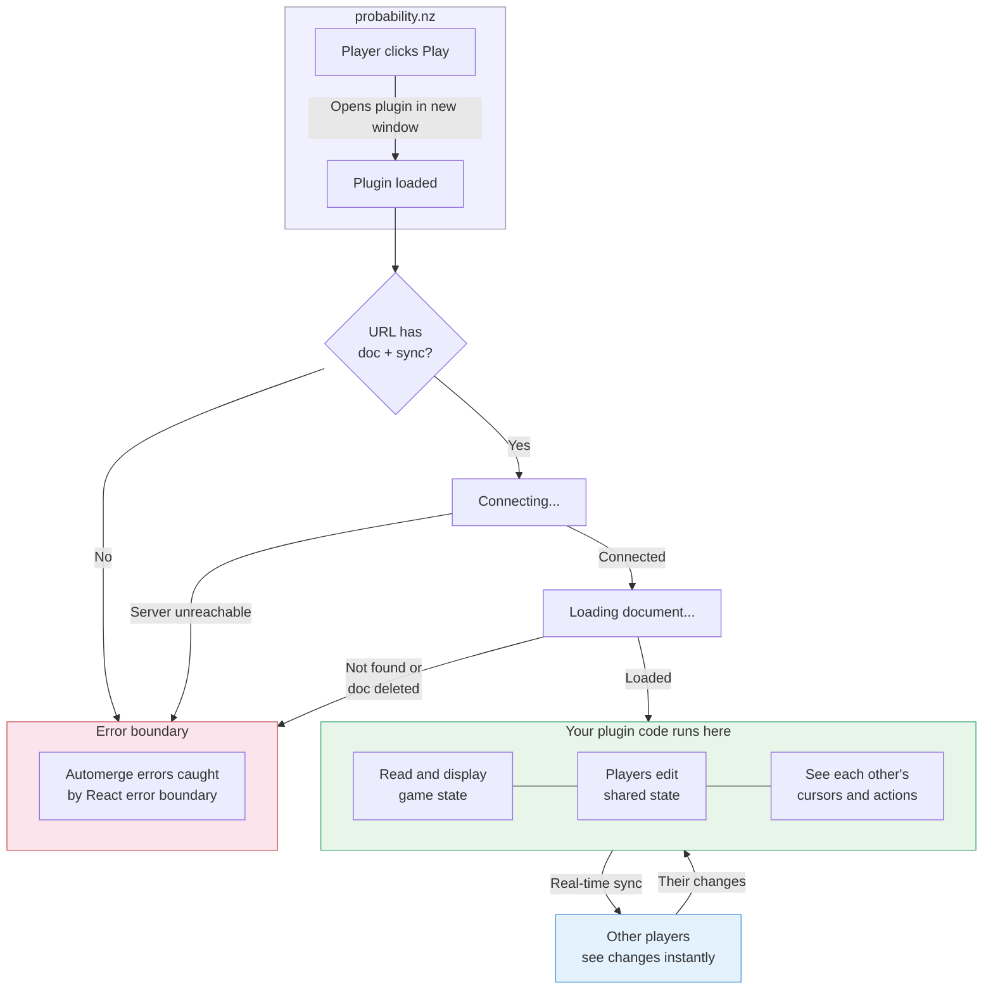

# @probability-nz/plugin-sdk

[probability.nz](https://probability.nz) is a freeform platform for playing tabletop & board games online. Players can move pieces, draw cards, and roll dice with no rules enforced, like a physical table.

Plugins add automation on top. A plugin can read and modify the game, and can do anything a player could do. Each plugin connects to a shared [automerge](https://automerge.org/) document (JSON object) that syncs between players. This SDK lets you build them with React.

## Quick start

```sh
git clone https://github.com/probability-nz/plugin-sdk
cd plugin-sdk/examples/debug
pnpm install
pnpm dev
```

Edit [`src/main.tsx`](./examples/debug/src/main.tsx) to build your plugin.

## Usage

```tsx
import { Suspense } from 'react';
import { useProbDocument } from '@probability-nz/plugin-sdk/react';

function MyPlugin({ docUrl }: { docUrl: AutomergeUrl }) {
  const [doc, changeDoc] = useProbDocument<{ count?: number }>(docUrl, { suspense: true });

  return (
    <button onClick={() => changeDoc(d => { d.count = (d.count ?? 0) + 1 })}>
      Count: {doc.count ?? 0}
    </button>
  );
}

// Must be wrapped in <Suspense> (loading) and an error boundary (errors)
<Suspense fallback={<p>Connecting...</p>}>
  <MyPlugin docUrl={docUrl} />
</Suspense>
```

`useProbDocument` connects to a shared document and returns `[doc, changeDoc]`. Mutations are validated against the game state schema and sync to all players in real-time.

### Hooks

From the SDK:

- **`useProbDocument(id, { suspense: true })`** — returns `[doc, changeDoc]`. Validates writes against the game state schema. Requires suspense mode.
- **`useEphemeralState(docUrl)`** — typed presence API. Returns `{ state, setState, peers }`. Two channels: `cursor` (focus/attention) and `op` (uncommitted mutation preview).

From `@automerge/react` (peer dep):

- **`useRepo()`** — raw automerge `Repo` instance for multi-doc or doc creation.
- **`useDocHandle(id)`** — raw `DocHandle` for advanced operations.

### Wiring

Wrap your plugin in `RepoProvider` to connect to the sync server. In the browser, `useHashStore` reads connection config from the URL hash:

```tsx
import { useHashStore } from '@probability-nz/plugin-sdk';
import { RepoProvider } from '@probability-nz/plugin-sdk/react';

function App() {
  const { context } = useHashStore();
  return (
    <ErrorBoundary>
      <RepoProvider sync={context.sync}>
        <Suspense fallback={<p>Connecting...</p>}>
          <MyPlugin docUrl={context.doc} />
        </Suspense>
      </RepoProvider>
    </ErrorBoundary>
  );
}
```

Non-browser environments (Electron, React Ink, tests) skip the hash and pass config as props directly.

## How it works

When a player clicks Play on probability.nz, it opens your plugin and connects it to a shared document. See the [automerge docs](https://automerge.org/docs/) for document operations.


