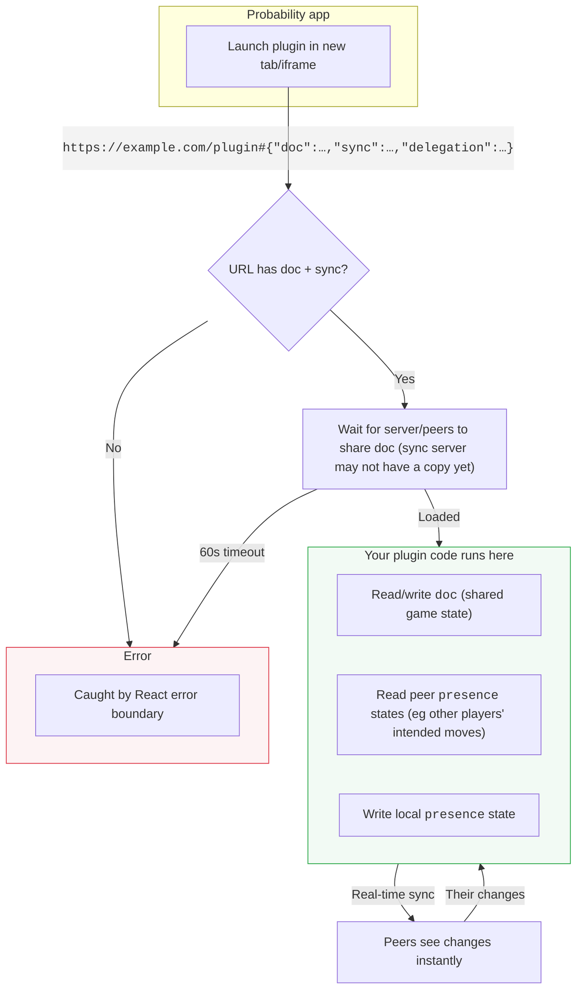

# @probability-nz/plugin-sdk

[Probability](https://probability.nz) is a freeform 3D platform for tabletop & board games. Plugins are external tools that can help with gameplay, act as an opponet, manage decks, etc.

## Quick start

```sh
git clone https://github.com/probability-nz/plugin-sdk
cd plugin-sdk/examples/debug
pnpm install
pnpm dev
```

Edit [`src/main.tsx`](./examples/debug/src/main.tsx) to build your plugin.

## How it works

The game is kept in an [automerge](https://automerge.org/) `document` (a big blob of shared JSON).

When a player drags a piece, we send out temporary data called `presence`, which shows their intended move to everyone. Once they drop the piece, we update the doc, confirming their move and adding it to the permanant game history.

Pieces are nested on each other. For example, a token, sitting on a card, sitting on a game board looks like:
```json
{
  "type": "board",
  "children": [
    {
      "type": "card",
      "children": [
        {
          "type": "token",
          "children": []
        }
      ]
    }
  ]
}
```

## Lifecycle

Plugins are web apps launched with a specific URL:

```
https://example.com/myplugin#{
  "doc": "automerge:123456789",
  "sync": [ "wss://sync.probability.nz" ],
  "delegation": "encryptedBase64String"
}
```

The JSON data after the `#` contains:
* The ID of the automerge `doc`
* Which `sync` servers to use
* An encrypted `delegation` string, describing who launched the plugin and what it's allowed to do



## Usage

```tsx
import { Suspense } from 'react';
import { useProbDocument } from '@probability-nz/plugin-sdk/react';

function MyPlugin({ docUrl }: { docUrl: AutomergeUrl }) {
  const [doc, changeDoc] = useProbDocument<{ count?: number }>(docUrl, { suspense: true });

  return (
    <button onClick={() => changeDoc(d => { d.count = (d.count ?? 0) + 1 })}>
      Count: {doc.count ?? 0}
    </button>
  );
}

// Must be wrapped in <Suspense> (loading) and an error boundary (errors)
<Suspense fallback={<p>Connecting...</p>}>
  <MyPlugin docUrl={docUrl} />
</Suspense>
```

`useProbDocument` connects to a shared document and returns `[doc, changeDoc]`. Mutations are validated against the game state schema and sync to all players in real-time.

### Hooks

- **`useProbDocument(id, { suspense: true })`** — returns `[doc, changeDoc]`. Validates writes against the game state schema. Requires `suspense: true`, else it will throw an error.

`usePresenceState` is for sharing short-lived data, like selections, or showing where someone wants to move a piece.
- **`usePresenceState(docUrl)`** — typed presence API. Returns `{ state, setState, peers }`. Two channels: `cursor` (focus/attention) and `op` (uncommitted mutation preview).

`useHashStore` is an optional replacement for react setState,  for non-shared state. The difference is that it's saved to the plugin URL, so that reloading the page or copying the URL will restore the plugin to that particular state.
