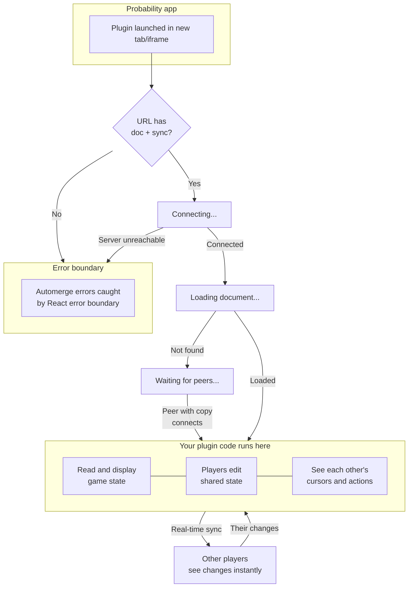

# @probability-nz/plugin-sdk

[probability.nz](https://probability.nz) is a freeform platform for playing tabletop & board games online. Players can move pieces, draw cards, and roll dice with no rules enforced, like a physical table.

This is the SDK for making plugins for Probability. Plugins are external tools that can do anything a player could do, like an assistant that moves pieces or shuffles cards for you. They can also create and organise decks and pieces like a GM. 

## Quick start

```sh
git clone https://github.com/probability-nz/plugin-sdk
cd plugin-sdk/examples/debug
pnpm install
pnpm dev
```

Edit [`src/main.tsx`](./examples/debug/src/main.tsx) to build your plugin.

## Lifecycle

Plugins are web apps launched with a specific url:

```
https://example.com/myplugin#{ "doc": "automerge:123456789", "sync": [ "wss://sync.probability.nz" ], "delegation": "encryptedBase64String" }
```

This url contains the ID of the automerge `doc`, which `sync` servers to use, and an encrypted `delegation` string which says who launched the plugin and what it's allowed to do.



> **How document loading works:** If the sync server already has a copy of the document, it loads instantly. If it doesn't, the plugin will keep waiting until another peer who has a copy connects to the same server and shares it. If no one connects within 60 seconds, it will give up and throw an error.

## Usage

```tsx
import { Suspense } from 'react';
import { useProbDocument } from '@probability-nz/plugin-sdk/react';

function MyPlugin({ docUrl }: { docUrl: AutomergeUrl }) {
  const [doc, changeDoc] = useProbDocument<{ count?: number }>(docUrl, { suspense: true });

  return (
    <button onClick={() => changeDoc(d => { d.count = (d.count ?? 0) + 1 })}>
      Count: {doc.count ?? 0}
    </button>
  );
}

// Must be wrapped in <Suspense> (loading) and an error boundary (errors)
<Suspense fallback={<p>Connecting...</p>}>
  <MyPlugin docUrl={docUrl} />
</Suspense>
```

`useProbDocument` connects to a shared document and returns `[doc, changeDoc]`. Mutations are validated against the game state schema and sync to all players in real-time.

### Hooks

Each plugin connects to an [automerge](https://automerge.org/) `document` (a big blob of JSON). This is the permanent store of all moves and changes in a game, and is shared between players. 
- **`useProbDocument(id, { suspense: true })`** — returns `[doc, changeDoc]`. Validates writes against the game state schema. Requires `suspense: true`, else it will throw an error.

`useEphemeralState` is for sharing short-lived data, like selections, or showing where someone wants to move a piece.
- **`useEphemeralState(docUrl)`** — typed presence API. Returns `{ state, setState, peers }`. Two channels: `cursor` (focus/attention) and `op` (uncommitted mutation preview).

`useHashStore` is an optional replacement for react setState,  for non-shared state. The difference is that it's saved to the plugin URL, so that reloading the page or copying the URL will restore the plugin to that particular state.
